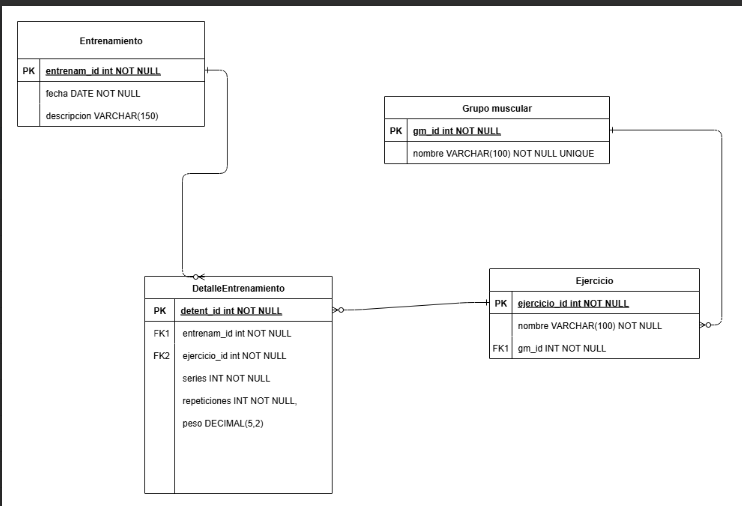

# GymTracker

**TENGO ESTE PROYECTO ACTUALMENTE EN PROCESO! NO ESTA FINALIZADO**

## 🚀 Descripción General
GymTracker es una aplicación desarrollada en **Java+Spring Boot** para gestionar entrenamientos en un gimnasio.
 
 
Por ahora, se está desarrollando únicamente el **Backend** 
 
 Mi idea es Desarrollarle despues un  **front** con angular o react para practicar
 
 Permite:  
- Que el **usuario** registre sus entrenamientos diarios y los pesos levantados por ejercicio.  
- Que el **administrador** cree y gestione **grupos musculares** y sus **ejercicios asociados**.  
- Planificar futuras funcionalidades para que los **usuarios** puedan:  
  - Visualizar el historial de entrenamientos.  
  - Analizar su progreso y mejoras en fuerza o resistencia.  
  - Registrar notas o comentarios sobre cada sesión de entrenamiento.  

---

## ⚙️ Tecnologías Utilizadas

- **Backend:** Java, Spring Boot  
- **Base de datos:**  SQL Server Managment Studio
- **Dependencias:** Spring Data JPA, Spring Web, Lombok  
- **DTOs:** Para separar entidades de la base de datos de la presentación
- **Seguridad:** SpringSecurity 

---

## 🗂️ Modelo Entidad-Relación

A continuación se muestra el modelo entidad-relación que representa la estructura principal de la base de datos utilizada por el sistema: 
 
 (Me falta agregar la tabla de usuarios cuando arme el  login)

---

## 🧪 Cómo Probar la API

📄 La documentación de la API se encuentra disponible en Swagger UI:

👉 [http://localhost:8080/swagger-ui/](http://localhost:8080/swagger-ui.html) 
> Asegurate de tener el proyecto corriendo localmente.

**AVANCES HASTA EL MOMENTO**

---

## 🗂️ Documentación API - Swagger UI -1

La siguiente imagen muestra la documentación automática generada por Swagger para la API de GymTracker. Desde aquí se pueden consultar y probar los distintos endpoints disponibles.

![Swagger UI]

---
**ADMINISTRADOR**

### Ejemplo de GET: trae los grupos musculares por ID -1 

Este endpoint:

- **Método:** `GET`
- **Descripción:** Devuelve grupo muscular por ID

#### Vista en Swagger:
![Swagger UI - GET Productos]

---

### Ejemplo de GET: trae todos los grupos musculares con sus correspondientes ejercicios -2

Este endpoint:

- **Método:** `GET`
- **Descripción:** Devuelve todos los grupoos musculares + ejercicios por grupo muscular 

#### Vista en Swagger:
![Swagger UI - GET Productos]

---

### Ejemplo de POST: Para agregar nuevos grupos musculares con sus correspondientes ejercicios -3

Este endpoint:

- **Método:** `POST`
- **Descripción:** Agrega nuevos grupos musculares + ejercicios (si ya esta creado no se vuelve a crear)

#### Vista en Swagger:
![Swagger UI - GET Productos]

---

### Ejemplo de PUT: Para actualizar un grupo muscular -4

Este endpoint:

- **Método:** `PUT`
- **Descripción:** Se puede modificar un grupo muscular por id con lo cual se puede modificar el nombre del grupo muscular o no o eso puede quedar como lo trae ese id que buscamos y se pueden agregar nuevos ejercicios si un ejercicio ya esta agregado
  no se va a volver a agregar (no duplica) - le puse un metodo tambien que no tiene en cuenta mayusculas-minusculas -

#### Vista en Swagger:
![Swagger UI - GET Productos]

---
**USUARIO**

### Ejemplo de Post: Para crear un entrenamiento -2

Este endpoint:

- **Método:** `POST`
- **Descripción:** el usuario puede crear un entrenamiento por dia en donde va a poder ir cargando que ejercicios fue realizando y cuanto peso levanto por ejercicio

#### Vista en Swagger:
![Swagger UI - GET Productos]

---

### Ejemplo de Put: Para actualizar un entrenamiento-3

Este endpoint:

- **Método:** `PUT`
- **Descripción:** el usuario puede actualizar un entrenamiento que ya exista si es que se confundio en algo

#### Vista en Swagger:
![Swagger UI - GET Productos]

---

### Ejemplo de Delete: Para actualizar un entrenamiento-4

Este endpoint:

- **Método:** `DELETE`
- **Descripción:** el usuario puede borrar un entrenamiento

#### Vista en Swagger:
![Swagger UI - GET Productos]

---
**Se continua trabajando...**

  

---

### 👩‍💻 Contacto

👩‍💻 Romina Olivera Luna
 
💌 rominalunaolivera@gmail.com
 
🔗 [LinkedIn
](https://www.linkedin.com/in/romina-bluna/)

[⬆️ Volver arriba](#readme)

---

© 2025 Romina Olivera Luna. Todos los derechos reservados.

Este README fue redactado íntegramente por Romina Olivera Luna y no puede ser reproducido, copiado ni distribuido sin permiso explícito.

El código fuente está licenciado bajo la Licencia MIT.  
Para más detalles, ver el archivo [LICENSE](LICENSE.txt).

---
